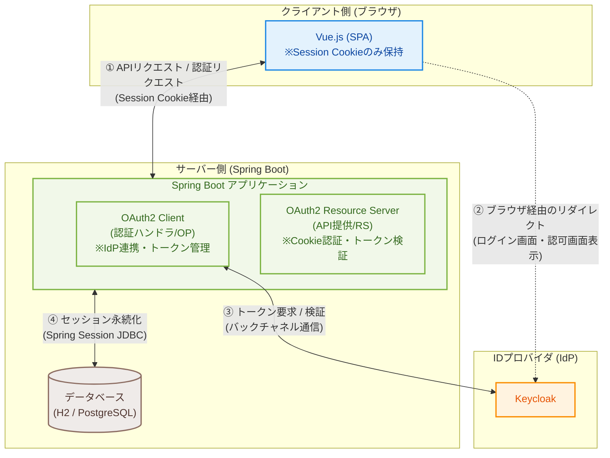
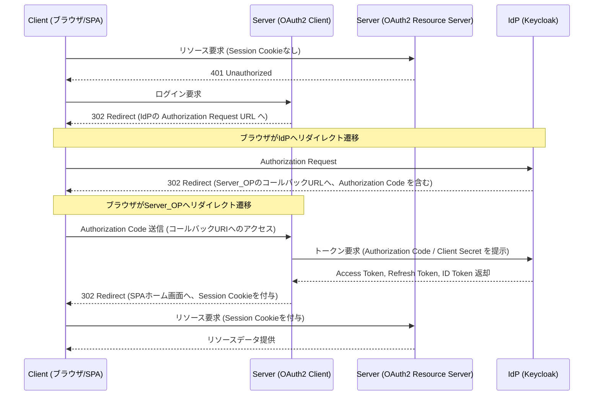

# demo-oidc-auth

OIDC認証のサンプルコード

| コンポーネント | 技術 |
|---|---|
| Client (SPA) | Vue.js 3 + Vite + Axios |
| Server | Spring Boot 4.1 (Spring Security 7) |
| IdP | Keycloak 26.6.3 |
| Java | Amazon Corretto 25 |
| DB (ローカル) | H2 (PostgreSQLモード) |
| DB (本番想定) | PostgreSQL |

## 概要

### Client (Vue.js)
- ログイン画面、ホーム画面を提供する。
- AxiosでResource ServerのAPIを呼び出す。
- ServerとはSession Cookieのみやり取りする。トークン類はブラウザに保持しない。
- AxiosはViteプロキシを使わず、`http://localhost:8080` へ直接リクエストする (`withCredentials: true`)。
- ログイン・ログアウトはServerのエンドポイントへのページ遷移 (ブラウザリダイレクト) で行う。

### Server (Spring Boot)
- OAuth2 Client (Spring Security 7) でKeycloakと連携し、認証する。
- OAuth2 Resource ServerでJWTを検証し、認可する。
- ClientとはSession Cookieで連携する。トークン類はServerのセッションに保持する。
- セッションはSpring Session JDBCでDBに永続化する。
- Access Token / Refresh TokenはセッションにOAuth2AuthorizedClientとして保持する。
- リクエスト毎にFilterでセッションからAccess Tokenを取り出し、SecurityContextHolderにセットする。
- Access Tokenが期限切れの場合、FilterでRefresh Tokenを使い自動更新する。
- CORS設定でClientオリジン (`http://localhost:5173`) を許可する (CORS設定サンプルを兼ねる)。
- DBはPostgreSQLとする。ただし、ローカル実行時はH2をPostgreSQLモードで利用する。

### IdP (Keycloak 26.6.3)
- demoレルム、demo-client、demoユーザをインポートする。
- `http://localhost:8180` で起動する。
- `demo-client` のリダイレクトURIに `http://localhost:8080/login/oauth2/code/keycloak` を設定する。
- `demo-client` のWeb Origins (CORS許可) に `http://localhost:5173` を設定する。

## 構成

ServerはOPとRSを兼ねるため、以下構成図ではOP/RSを分けて記載する。




## シーケンス



---

## セットアップと起動手順

### 1. IDプロバイダ (Keycloak) のセットアップ

Keycloakは `C:\keycloak\26.6.3` にインストールされている前提となります。

**領域 (Realm) 設定のインポート**
まず、Keycloakが停止している状態で、定義済みのレルム設定をインポートします。

- **Windows Command Prompt (cmd)**
  ```cmd
  C:\keycloak\26.6.3\bin\kc.bat import --file keycloak\demo-realm.json --overwride true
  ```
- **Bash (Git Bash / WSL)**
  ```bash
  /c/keycloak/26.6.3/bin/kc.sh import --file keycloak/demo-realm.json --overwride true
  ```

**Keycloak の起動 (デモ実行のみの場合)**
Server (ポート8080) と競合しないよう、ポート `8180` を指定して起動します。
（インポートされた `demo` レルムのテストユーザー `demo` / `demo` を使用してアプリ動作の検証のみを行う場合は、これで十分です）

- **Windows Command Prompt (cmd)**
  ```cmd
  C:\keycloak\26.6.3\bin\kc.bat start-dev --http-port 8180
  ```
- **Bash**
  ```bash
  /c/keycloak/26.6.3/bin/kc.sh start-dev --http-port 8180
  ```

**Keycloak の起動 (管理者コンソールへのログイン設定付き)**
Keycloakの管理画面 (`http://localhost:8180/admin`) にログインして設定を確認したい場合は、初回起動時に環境変数で管理者IDとパスワードを指定します。

- **Windows Command Prompt (cmd)**
  ```cmd
  set KEYCLOAK_ADMIN=admin
  set KEYCLOAK_ADMIN_PASSWORD=admin
  C:\keycloak\26.6.3\bin\kc.bat start-dev --http-port 8180
  ```
- **Bash**
  ```bash
  export KEYCLOAK_ADMIN=admin
  export KEYCLOAK_ADMIN_PASSWORD=admin
  /c/keycloak/26.6.3/bin/kc.sh start-dev --http-port 8180
  ```
  ※起動後、ブラウザで `http://localhost:8180/admin` にアクセスし、`admin` / `admin` でログインできます。

---

### 2. Server (Spring Boot) の起動

Java 25 (Amazon Corretto) が利用可能であることを確認してください。

```cmd
cd demo-oidc-auth-server
./mvnw.cmd spring-boot:run
```
(Unix/Bash環境の場合は `./mvnw spring-boot:run` を使用してください)

サーバーは `http://localhost:8080` で起動します。

---

### 3. Client (Vue.js) の起動

```cmd
cd demo-oidc-auth-client
npm install
npm run dev
```

クライアントは `http://localhost:5173` で起動します。

---

## 動作確認フロー

1. ブラウザで `http://localhost:5173` にアクセスします。
2. ログインしていないため、`/login`（SPAのログイン画面）へ遷移します。
3. **「Keycloakでログイン」**ボタンをクリックすると、Keycloakの認可画面 (`http://localhost:8180`) に遷移します。
4. 以下のデモアカウント情報でログインします。
   - ユーザー名: `demo`
   - パスワード: `demo`
5. ログインが成功すると、SPAのホーム画面（`http://localhost:5173/`）にリダイレクトされ、Keycloakから取得したユーザー情報が表示されます。
6. **「ログアウト」**ボタンをクリックするとセッションが破棄され、再びログイン画面へ戻ります。
