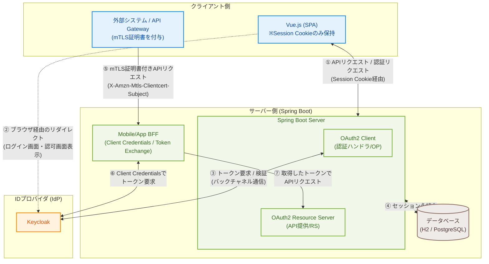
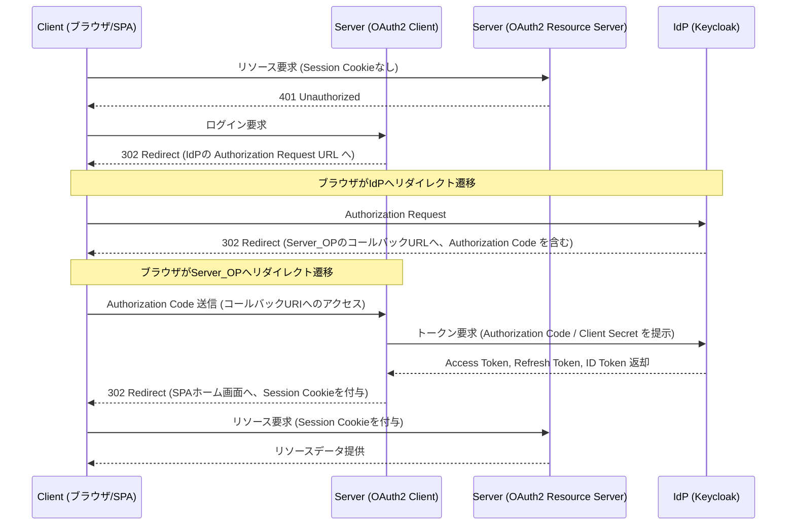
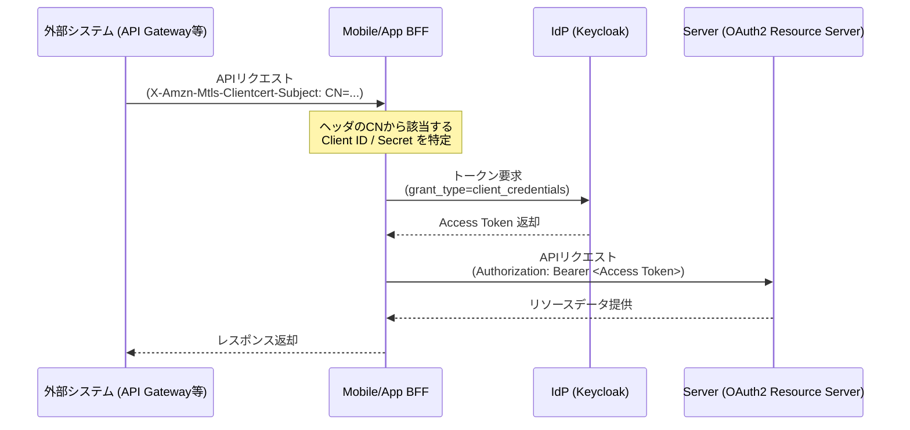

# demo-oidc-auth

OIDC認証のサンプルコード

| コンポーネント | 技術                                |
| -------------- | ----------------------------------- |
| Client (SPA)   | Vue.js 3 + Vite + Axios             |
| Server         | Spring Boot 4.1 (Spring Security 7) |
| Mobile/App BFF | Spring Boot 4.1 (Spring Security 7) |
| IdP            | Keycloak 26.6.3                     |
| Java           | Amazon Corretto 25                  |
| DB (ローカル)  | H2 (PostgreSQLモード)               |
| DB (本番想定)  | PostgreSQL                          |

## 概要

### Client (Vue.js)
- ログイン画面、ホーム画面を提供する。
- AxiosでResource ServerのAPIを呼び出す。
- ServerとはSession Cookieのみやり取りする。トークン類はブラウザに保持しない。
- AxiosはViteプロキシを使わず、`http://localhost:8080` へ直接リクエストする (`withCredentials: true`)。
- ログイン・ログアウトはServerのエンドポイントへのページ遷移 (ブラウザリダイレクト) で行う。

### Server (Spring Boot)
- OAuth2 Client (Spring Security 7) でKeycloakと連携し、認証する。
- OAuth2 Resource ServerでJWTを検証し、認可する。
- ClientとはSession Cookieで連携する。トークン類はServerのセッションに保持する。
- セッションはSpring Session JDBCでDBに永続化する。
- Access Token / Refresh TokenはセッションにOAuth2AuthorizedClientとして保持する。
- リクエスト毎にFilterでセッションからAccess Tokenを取り出し、SecurityContextHolderにセットする。
- Access Tokenが期限切れの場合、FilterでRefresh Tokenを使い自動更新する。
- CORS設定でClientオリジン (`http://localhost:5173`) を許可する (CORS設定サンプルを兼ねる)。
- DBはPostgreSQLとする。ただし、ローカル実行時はH2をPostgreSQLモードで利用する。

### Mobile/App BFF (Spring Boot)
- スマホ・タブレットアプリからのアクセス確認用に、既存Serverとは別のBFFとして提供する。
- アプリからAPI Serverへ直接アクセスせず、BFFのSession Cookie経由で認証状態を管理する。
- BFFはKeycloakの `demo-oidc-auth-mobile-bff` クライアントで認証する。
- BFFはログイン済みセッションのAccess TokenをToken Exchangeし、交換後のAccess Tokenで `demo-oidc-auth-server` のAPIを呼び出す。
- API Gateway等を経由した外部システムからのアクセス向けに、クライアント証明書のDNに基づいたClient Credentials Flowも提供する。
- サンプル名は用途が分かるよう `demo-oidc-auth-mobile-bff` としている。

### IdP (Keycloak 26.6.3)
- demoレルム、demo-oidc-auth-client-bff、demo-oidc-auth-mobile-bff、demo-oidc-auth-server、demoユーザをインポートする。
- `http://localhost:8180` で起動する。
- `demo-oidc-auth-client-bff` のリダイレクトURIに `http://localhost:8080/login/oauth2/code/keycloak` を設定する。
- `demo-oidc-auth-client-bff` のWeb Origins (CORS許可) に `http://localhost:5173` を設定する。
- `demo-oidc-auth-mobile-bff` のリダイレクトURIに `http://localhost:8081/mobile-bff/login/oauth2/code/keycloak` を設定する。
- `demo-oidc-auth-mobile-bff` は Keycloak で `serviceAccountsEnabled=true` および `standard.token.exchange.enabled=true` を有効にしておく必要がある。
- `demo-oidc-auth-server` は bearer-only クライアントとして定義され、Token Exchange の結果として発行されたアクセストークンを受け取る。

## 構成

ServerはOPとRSを兼ねるため、以下構成図ではOP/RSを分けて記載する。
BFFはToken ExchangeやClient Credentialsを利用してServer(RS)へアクセスする。




## シーケンス

### 認可コードフロー (SPA)



### クライアントクレデンシャルズフロー (外部システム → BFF → Server)



---

## セットアップと起動手順

### 1. IDプロバイダ (Keycloak) のセットアップ

Keycloakは `C:\keycloak\26.6.3` にインストールされている前提となります。

**領域 (Realm) 設定のインポート**
まず、Keycloakが停止している状態で、定義済みのレルム設定をインポートします。

```cmd
C:\keycloak\26.6.3\bin\kc.bat import --file keycloak\demo-realm.json --override true
```

```bash
/c/keycloak/26.6.3/bin/kc.sh import --file keycloak/demo-realm.json --override true
```

**Keycloak の起動 (デモ実行のみの場合)**
Server (ポート8080) と競合しないよう、ポート `8180` を指定して起動します。
（インポートされた `demo` レルムのテストユーザー `demo` / `demo` を使用してアプリ動作の検証のみを行う場合は、これで十分です）

```cmd
C:\keycloak\26.6.3\bin\kc.bat start-dev --http-port 8180
```

```bash
/c/keycloak/26.6.3/bin/kc.sh start-dev --http-port 8180
```

**Keycloak の起動 (管理者コンソールへのログイン設定付き)**
Keycloakの管理画面 (`http://localhost:8180/admin`) にログインして設定を確認したい場合は、初回起動時に環境変数で管理者IDとパスワードを指定します。

```cmd
set KEYCLOAK_ADMIN=admin
set KEYCLOAK_ADMIN_PASSWORD=admin
C:\keycloak\26.6.3\bin\kc.bat start-dev --http-port 8180
```

```bash
export KEYCLOAK_ADMIN=admin
export KEYCLOAK_ADMIN_PASSWORD=admin
/c/keycloak/26.6.3/bin/kc.sh start-dev --http-port 8180
```
※起動後、ブラウザで `http://localhost:8180/admin` にアクセスし、`admin` / `admin` でログインできます。

---

### 2. Server (Spring Boot) の起動

Java 25 (Amazon Corretto) が利用可能であることを確認してください。

```cmd
cd demo-oidc-auth-server
mvnw.cmd spring-boot:run
```

```bash
cd demo-oidc-auth-server
./mvnw spring-boot:run
```

サーバーは `http://localhost:8080` で起動します。

---

### 3. Mobile/App BFF (Spring Boot) の起動

別ターミナルで起動します。

```cmd
cd demo-oidc-auth-mobile-bff
mvnw.cmd spring-boot:run
```

```bash
cd demo-oidc-auth-mobile-bff
./mvnw spring-boot:run
```

Mobile/App BFFは `http://localhost:8081/mobile-bff` で起動します。

---

### 4. Client (Vue.js) の起動

```cmd
cd demo-oidc-auth-client
npm install
npm run dev
```

クライアントは `http://localhost:5173` で起動します。

---

## 動作確認フロー

1. ブラウザで `http://localhost:5173` にアクセスします。
2. ログインしていないため、`/login`（SPAのログイン画面）へ遷移します。
3. **「Keycloakでログイン」**ボタンをクリックすると、Keycloakの認可画面 (`http://localhost:8180`) に遷移します。
4. 以下のデモアカウント情報でログインします。
   - ユーザー名: `demo`
   - パスワード: `demo`
5. ログインが成功すると、SPAのホーム画面（`http://localhost:5173/`）にリダイレクトされ、Keycloakから取得したユーザー情報が表示されます。
6. **「ログアウト」**ボタンをクリックするとセッションが破棄され、再びログイン画面へ戻ります。

### Mobile/App BFF の動作確認

1. Keycloak、Server、Mobile/App BFFを起動します。
2. ブラウザまたはアプリ内ブラウザで `http://localhost:8081/mobile-bff/oauth2/authorization/keycloak` にアクセスします。
3. `demo` / `demo` でログインします。
4. 認証後、`http://localhost:8081/mobile-bff/api/session` でBFFのログイン状態を確認します。
5. `http://localhost:8081/mobile-bff/api/user` にアクセスし、BFFがToken Exchange後のAccess Tokenで `demo-oidc-auth-server` の `/api/v2/user` を呼び出せることを確認します。

実機のスマホ・タブレットから確認する場合は、`localhost` をPCのLAN内IPアドレスに置き換え、KeycloakのRedirect URI/Web Originsも同じホスト名に合わせて追加してください。

### Mobile/App BFF の自動E2E確認

Keycloak、Server、Mobile/App BFFを起動した状態で、E2Eテストを実行できます。Chromeがインストールされている環境を想定しています。

#### Selenium + JUnit でのE2E確認

```cmd
cd demo-oidc-auth-mobile-bff
mvnw.cmd -Pe2e-selenium verify
```

```bash
cd demo-oidc-auth-mobile-bff
./mvnw -Pe2e-selenium verify
```

ブラウザを表示して確認したい場合は、以下のように実行します。

```cmd
mvnw.cmd -Pe2e-selenium verify -Dbff.e2e.headless=false
```

```bash
./mvnw -Pe2e-selenium verify -Dbff.e2e.headless=false
```

#### Playwright + JUnit でのE2E確認

Playwright を使用した同様のテストも実装しています。以下の手順で実行できます。

```cmd
cd demo-oidc-auth-mobile-bff
mvnw.cmd -Pe2e-playwright verify
```

```bash
cd demo-oidc-auth-mobile-bff
./mvnw -Pe2e-playwright verify
```

ブラウザを表示して確認したい場合は、以下のように実行します。

```cmd
mvnw.cmd -Pe2e-playwright verify -Dbff.e2e.headless=false
```

```bash
./mvnw -Pe2e-playwright verify -Dbff.e2e.headless=false
```

または、特定のテストクラスを指定して実行することもできます。

```cmd
mvnw.cmd -Pe2e-playwright verify -Dtest=MobileBffPlaywrightIT
```

```bash
./mvnw -Pe2e-playwright verify -Dtest=MobileBffPlaywrightIT
```

## クライアントクレデンシャルズフロー (mTLS 証明書連携)

本アプリでは、API Gateway や ALB 経由で渡されるクライアント証明書のサブジェクトDN (`X-Amzn-Mtls-Clientcert-Subject` ヘッダ) に基づき、クライアントごとに動的に OAuth2 クライアントを切り替えて Client Credentials Flow を実行する実装サンプルが含まれています。

### 実装方針
- **設定によるクライアント管理**: `application.yml` の `app.client-credentials.clients` に、証明書の CN (Common Name) と Keycloak の `client-id` / `client-secret` のマッピングを定義します。
- **動的トークン取得**: `/api/client-credentials` エンドポイントで `X-Amzn-Mtls-Clientcert-Subject` ヘッダから `CN=` の値を抽出し、マップから対応する認証情報を取得します。
- **直接トークン要求**: Spring Security の静的なプロバイダ登録ではなく、`RestClient` を用いて Keycloak のトークンエンドポイントへ直接 `client_credentials` グラントのリクエストを送信します。
- **エラーハンドリング**: 未登録の CN やヘッダが存在しない場合は、`ResponseStatusException` により HTTP 403 (Forbidden) を返却します。
- **リソースサーバー呼び出し**: 取得したアクセストークンを用いて、自動的に `demo-oidc-auth-server` のAPI (`/api/v2/user`) を呼び出し、結果を合わせて返却します。

### 実行方法

**1. curlコマンドによる手動確認**
Keycloak、Server、Mobile/App BFF が起動している状態で、以下のコマンドを実行します。
```bash
curl -v -H "X-Amzn-Mtls-Clientcert-Subject: CN=demo1@example.com" http://localhost:8081/mobile-bff/api/client-credentials
```

**2. 自動E2Eテストでの実行**
Selenium または Playwright を用いたテストケース (`callClientCredentialsApiWithCertHeader`) にて動作検証が可能です。ブラウザ操作では通常追加できないカスタムリクエストヘッダを、Chrome DevTools Protocol (CDP) や Playwright の API を利用して差し込み、テストを実行しています。

- Playwright の場合
```bash
cd demo-oidc-auth-mobile-bff
./mvnw -Pe2e-playwright verify -Dit.test=MobileBffPlaywrightIT#callClientCredentialsApiWithCertHeader
```

- Selenium の場合
```bash
cd demo-oidc-auth-mobile-bff
./mvnw -Pe2e-selenium verify -Dit.test=MobileBffSeleniumIT#callClientCredentialsApiWithCertHeader
```

## スイッチユーザー（ユーザーなりすまし）機能

本デモアプリケーションには、管理者ユーザーが他の一般ユーザーになりすます「スイッチユーザー」機能のサンプルが実装されています。
OIDC / OAuth2 環境下における異なるなりすましアプローチの比較学習用として、以下の2つの方式を提供しています。

| 方式                           | 仕組み                                                                               | JWT の状態                                                      | 外部連携への影響                                                                         |
| :----------------------------- | :----------------------------------------------------------------------------------- | :-------------------------------------------------------------- | :--------------------------------------------------------------------------------------- |
| **Approach A: セッション方式** | バックエンドの HTTP セッション内でのみユーザー情報を差し替える擬似スイッチ           | 元の管理者 (`admin`) のまま。`sub` クレーム等は書き換わらない。 | 外部のリソースサーバー等と連携する場合、管理者権限でアクセスしてしまうため不適。         |
| **Approach B: Token Exchange** | Keycloak の OAuth 2.0 Token Exchange (RFC 8693) 機能を利用してトークンそのものを交換 | 対象の一般ユーザー (`demo`) の本物の JWT に差し替わる。         | トークンそのものが交換されているため、外部のリソースサーバー等へアクセスする場合も安全。 |

### 動作確認手順

#### 1. 事前準備
1. **Keycloak Realm の再インポート**
   - ロール情報および `admin` ユーザーを追加した [keycloak/demo-realm.json](file:///c:/workspace/demo-oidc-auth/keycloak/demo-realm.json) をインポートして Keycloak を起動します。
2. **サーバーとクライアントの起動**
   - `demo-oidc-auth-server` と `demo-oidc-auth-client` を起動します。

#### 2. 管理者ユーザーでのログイン
1. `http://localhost:5173/` にブラウザでアクセスします。
2. ログイン画面から Keycloak へ遷移し、管理者ユーザー **`admin` / `admin`** でログインします。
3. ログイン完了後、画面に `ROLE_ADMIN` ロールバッジが表示され、画面下部に「スイッチユーザー」パネルが表示されていることを確認します。

#### 3. Approach A（セッション方式）のテスト
1. パネルのテキストボックスに切替先ユーザー名 `demo` を入力し、**「Approach A セッション方式」**をクリックします。
2. 画面上部にオレンジ色のなりすましバナーが表示され、ユーザー表示が `demo` に切り替わります。
3. ユーザー情報の「ユーザーID (sub)」欄が `(session switch: ...)` になり、**「実際のJWT username」は `admin` のままであること**を確認します。
4. バナーの「元に戻す」ボタンをクリックし、元の `admin` 表示に戻ることを確認します。

#### 4. Approach B（Token Exchange方式）のテスト
1. 同様に入力欄に `demo` を入力し、**「Approach B Token Exchange」**をクリックします。
2. 画面上部に緑色のなりすましバナーが表示され、ユーザー表示が `demo` に切り替わります。
3. ユーザー情報の「ユーザーID (sub)」欄が `demo` ユーザーの本物のUUIDになり、**「実際のJWT username」も `demo` に切り替わっていること**を確認します。
4. 「元に戻す」ボタンをクリックし、元の `admin` 表示に戻ることを確認します。
